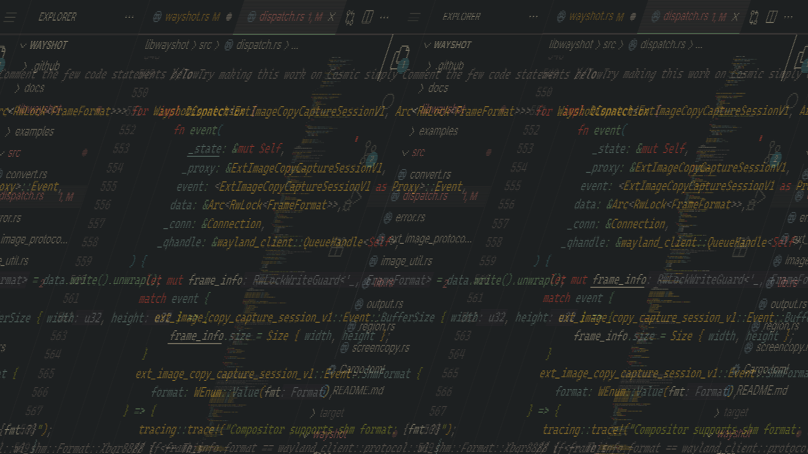

## **Bloopers and Funky Glitches**

This isn't technically part of the main project report, but development is rarely a straight line. I wanted to share a couple of the fun mistakes and weird bugs I encountered along the way! 👾

---

### **The Accidental Focus-Powered Stream**

While I was experimenting with the streaming usecase, I accidentally built what I can only describe as a "focus-powered" screen recorder.

To give you some context, the new `ext_*` protocols are incredibly efficient. It turns out that on COSMIC, the compositor would send a "new frame" signal every time my mouse focus changed to a different window or moved to another virtual desktop. My simple streaming code, eager to be helpful, saw this new frame and immediately grabbed it.

The result? A "stream" that didn't care what was happening *inside* the window.
It only captured a new image when a new frame was sent to the compositor. 
You can see it in action in the video below - the terminal is capturing frames, 
but only when the frame needs to be destroyed and generated again!

[Video.mp4](Video.mp4)

---

### **The Retro Glitch**

This next one was a wild discovery made by my mentor, Rachancheet, while he was running tests on COSMIC. The resulting screenshot came out looking like something from a retro PC or a beautifully corrupted image file.

The likely culprit is a GPU rendering bug, probably related to NVIDIA drivers interacting with the still-in-alpha COSMIC compositor. When we ran the exact same test on Sway, everything worked perfectly fine.

Still, you have to admit the glitch has a certain retro vibe to it. It’s a great reminder that even bugs can be interesting!