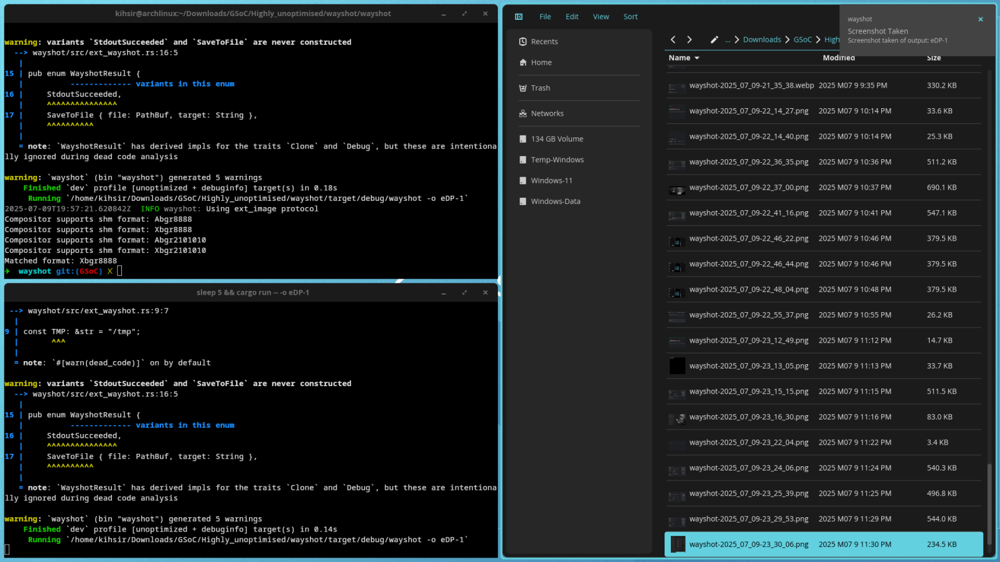

## **Fixing COSMIC**

At this point, I had come to a halt in my progress. I felt I still lacked the knowledge to properly tackle the streaming usecase, and I was also stuck on how to proceed with capturing application-specific windows.

-----

### The Next Step: `ext_foreign_toplevel_list_v1`

To capture a specific application, Wayshot needs to support a new protocol: `ext_foreign_toplevel_list_v1`.

This protocol is part of the same group as `ext_image_capture_source_v1`, but its specific job is to enumerate "toplevel" objects - basically, application windows - as potential capture sources.

Before moving on, I'll explain a bit more about how smartly it works. The protocol doesn't just track a Process ID (PID). It tracks the actual windows visible on the desktop.

- For example, if you have a file explorer and a terminal open, both will be shown as distinct capture sources.
- But let's say you have Firefox open with three tabs. It will show one Firefox window as a capture source. Now, what if you tear off one of those tabs into its own separate window? The PID of Firefox hasn't changed, but you now have two distinct windows. `ext_foreign_toplevel_list_v1` is smart enough to see this and will now offer **both** Firefox windows as separate capture sources.

-----

### Why I Couldn't Proceed

The reason I hadn't talked about this protocol yet is simple: I couldn't test it.

I went back to the simple info-gathering client I wrote in `Thought_Process_4.md` and ran it on my `sway-git` environment. The output confirmed that `sway-git` still didn't have support for `ext_foreign_toplevel_list_v1`. I was blocked.

-----

### A Lucky Discovery and a New Plan

However, out of pure luck, when I ran that same tool on **COSMIC**, my daily driver, I found that **it did support this protocol\!**

This discovery completely changed my direction. I realized that fixing the bugs that prevented Wayshot from working on COSMIC was now the most important step. It would not only allow Wayshot to run on my main compositor but, more importantly, it would unblock my future work on application capture.

My plan had refocused: get Wayshot working perfectly in COSMIC.

-----

With my new goal set on making Wayshot work in COSMIC, I started debugging. I knew the compositor had all the necessary protocols, but for some unknown reason, captures just refused to work.

I started by rewiring everything from scratch to pinpoint where the error was occurring. All signs pointed to a **pixel format issue**.

I spent countless hours on it, double-checking if I had accidentally changed something in Wayshot's `convert.rs` file, but I hadn't. My changes shouldn't have impacted format conversion at all.

In a moment of coincidence, a Waycrate member, Gigas007, mentioned on an issue that some formats were missing. I immediately added them, hoping for an easy fix, but... the output didn't change. The error was still related to the format.

-----

### Gathering More Data

Not understanding the root cause, I modified the code to directly print the formats supported by the compositor, similar to my info-gathering tool. The results were puzzling:

- **COSMIC Supported:** `Argb8888`, `Xrgb8888`, `Abgr2101010`, `Xrgb2101010`
- **Sway-git Supported:** `Xrgb8888`

The code was correctly matching with `Argb8888` on COSMIC, which should have worked. Yet, it failed every time. On `sway-git`, it matched with `Xrgb8888` and worked perfectly. Why would a correct match fail only on COSMIC?

-----

### A Quick Detour: Notifications

While stuck on this frustrating bug, I was getting increasingly worried about not having any new progress to show my mentors. So, I took a quick break to work on a smaller feature: **notifications**.

I was able to finish this quickly by adapting **Decode's code**. His version showed a simple "Passed" or "Failed" message. I modified it to be more descriptive, so it would notify the user exactly which output was captured (e.g., "Screenshot of eDP-1 taken").

-----

### The Breakthrough: Trial and Error

Coming back to the COSMIC issue, adding more error handling didn't help. Finally, out of desperation, I decided to just force each available format, one by one, to see what would happen. The results were bizarre:

- `Argb8888` -\> Didn't work (the default, "correct" match).
- `Abgr2101010` -\> Failed later with a `wl_shm` memory error.
- **`Xrgb8888` -\> IT WORKED\!?\!?**
- `Xrgb2101010` -\> Failed, saying it didn't exist, even though the compositor advertised support for it.

I was shocked. I forced `Xrgb8888` when running on COSMIC, and suddenly, everything in the `ext_protocol` method started working, including the new notifications.

Image taken on COSMIC:

The lesson learned: **COSMIC, still being in alpha, has its quirks.** This was a big one that I discovered as a byproduct of this project. With the fix in place, Wayshot was finally running smoothly on my daily driver.

\<- Back: [Back](Thought_Process_9.md)\<br\>
Forward: [Next](Thought_Process_11.md) -\>