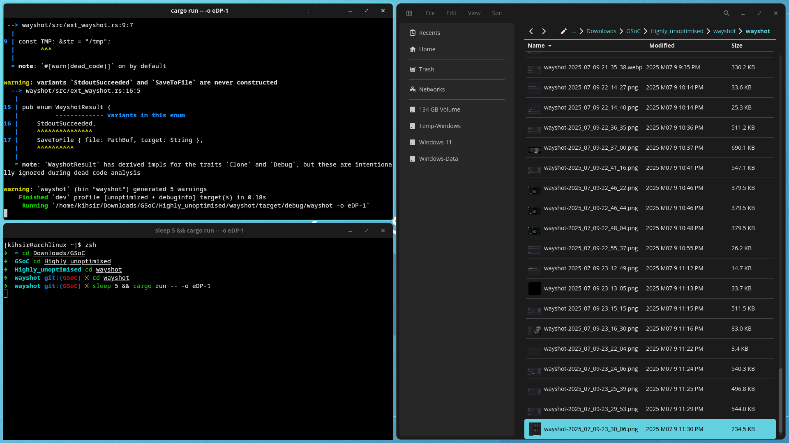
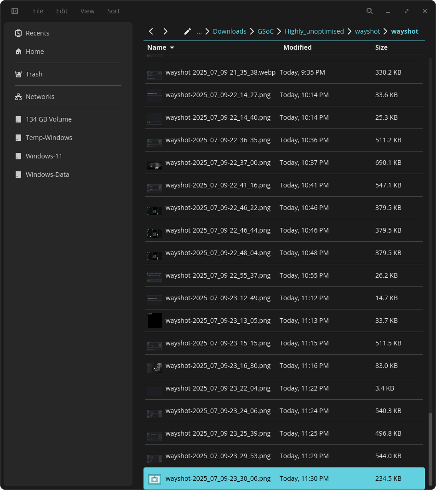

## **Success with Toplevel (Application) Capture**

Now that Wayshot was working reliably on COSMIC, the path was finally clear to start working on **toplevel capture** - in other words, application-specific screenshots.

---

### Implementation and a Sway Update

The implementation for this on COSMIC worked out well without any major issues. I simply needed to add the logic to handle the new information provided by the `ext_foreign_toplevel_list_v1` protocol, such as application IDs, the toplevel's window name, and whether it was the currently active window.

At the same time, there was a great development in the wlroots world. While my `sway-git` environment had become a bit outdated, **Sway stable** received an update that officially included all the new `ext_*` protocols - even `ext_foreign_toplevel_list_v1`, which was missing before\!

I tested the new feature on the updated stable Sway, and thankfully, everything worked perfectly there as well. With that, toplevel capture was successfully implemented.

---

### Toplevel Capture in Action

Here is a screenshot of an entire output:

And here is a screenshot of just the file manager application, captured directly without any need for manual cropping:

There are a couple of unique features that make this capture method very powerful:

- An application can be captured even if it's on a different virtual desktop (e.g., you are on Workspace 1, and the app is on Workspace 2).
- It captures the *entire* application window, even if it's partially dragged beyond the borders of the screen.

---

### Final Polish

Finally, I implemented all the remaining features to bring this new capture mode to parity with the others. This included support for piping the image directly to the **clipboard** or to `stdout`.

I also added a notification to inform the user which application was captured. This is an important privacy feature to let a user know if a specific app was screenshotted, preventing unannounced captures.

  <a href="Thought_Process_10.md">&lt;- Back</a>
  <a href="Thought_Process_12.md">Next -&gt;</a>

