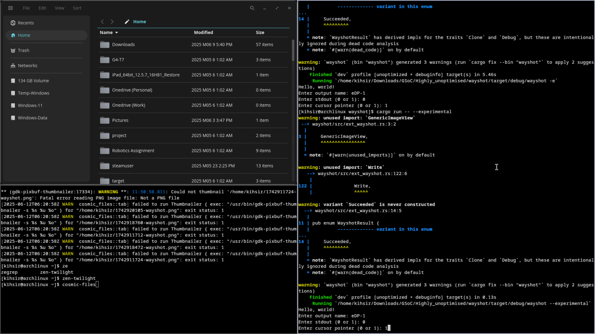

## **Building the Prototype: A Self-Contained Approach**

With my development environment ready, it was time to dive into the core of the project: implementing the new `ext-image-capture-source-v1` and `ext-image-copy-capture-v1` protocols.

My initial goal wasn't to perfectly integrate them into Wayshot's existing structure. It was much simpler and more pragmatic: **just make it work.**

To avoid breaking the stable, existing `wlr-screencopy` backend, I decided to build the new implementation in a completely separate but attached module. I created a new file, `ext_image_protocols.rs`, inside `libwayshot` to serve as a self-contained workshop.

This "skunkworks" approach meant starting almost entirely from scratch within that file:

* **New Structs:** I created new structures like `ExtWayshotState`, `ImageInfo`, and `CaptureOutputData` specifically for the new protocol's logic.
* **Custom Errors:** A new set of `Error` enums was created to handle potential failures from the new protocols.
* **A New Dispatcher:** While I could reuse some existing Wayland objects, I implemented a completely new dispatch function to handle events for the `ext_image_*` protocols.

> I even intentionally duplicated some existing code for things like handling `Region`, `size`, and `position`.  
> **Why?** To keep the new experimental code completely isolated. 
> If something broke, I'd know it was my new code and not an unforeseen interaction with the older, stable `wlr` backend. 
> The primary goal was a working proof-of-concept, not clean code—that would come later.

-----

### Standing on the Shoulders of Giants

I want to give a huge credit to **Decode's code**. His implementation served as an invaluable reference and guide for my initial work. Navigating the new protocols would have been significantly slower without being able to study and learn from his approach. Thank you\!!

-----

### The First Milestone

After laying all this groundwork—the new structs, the error handling, the dispatcher, and the necessary boilerplate—I finally achieved my first major goal: **I made `libwayshot` take a plain, simple screenshot of an entire output using the new official Wayland protocols.**

It wasn't fancy, but it was a critical success. The prototype worked.

I also Added cursor logic already present in wlr method.

The image below is one of the very first captures I took using the new `ext_image_*` backend on Sway-git. \

<- Back: [Back](Thought_Process_4.md) 
Forward: [Next](Thought_Process_6.md) ->