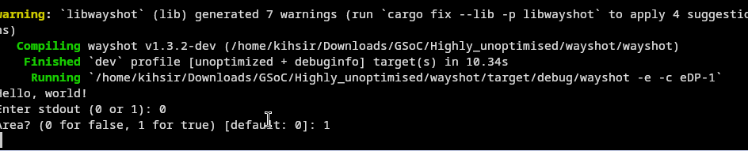
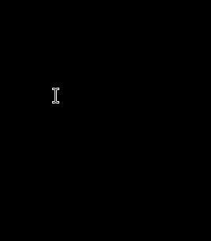

## **Working on Area Capture**

With full-output capture working reliably, the next major feature on the list was **area capture**—allowing a user to select a specific region of the screen.

Before diving into the new logic, I took a moment to do some important housekeeping. I went back and removed the redundant, duplicated code from the prototype in `ext_image_protocols.rs`. With the proof-of-concept phase over, it was time to start building a cleaner, more integrated solution.

-----

### Hitting a Wall with `wlr-layer-shell`

My initial approach to creating the area selection overlay used the `wlr_layer_shell` protocol. I tested it on my daily driver, COSMIC, but it failed to work. My first assumption was straightforward: "Of course, COSMIC isn't a wlroots-based compositor, so it's not expected to support a wlroots-specific protocol."

So, I ran the code on `sway-git` to test it on a compositor that *definitely* has those protocols. But that's when things got confusing—it still didn't work.

To make sure I wasn't going crazy, I tried running the *original* `wlr` area capture method in Wayshot.

- On stable Sway, it worked perfectly.
- On **`sway-git`**, even the original method failed\!

So the problem wasn't just my code. I was stuck. I couldn't test my new feature on stable Sway (because it doesn't have the `ext_image_*` protocols), and the protocol I was using for the overlay seemed to be broken on the newer `sway-git`.

-----

### The Solution: Switching to `xdg-shell`

Instead of waiting and struggling with a wlroots-specific issue, I decided to change my focus. I shifted from using `wlr_layer_shell` to using the standard **`xdg-shell`** protocol.

This was like hitting two birds with one stone:

1.  It would (hopefully) fix the issue I was seeing.
2.  It would make the feature compatible with almost **every** Wayland compositor, not just wlroots-based ones.

So, I replaced all the `LayerShellState` logic with `XdgShellState`.

And thankfully, **it worked.** 🎉

The area capture now worked correctly using the new `ext_image_*` protocols on sway-git.

As a final step, I went ahead and implemented cursor capturing for the area capture mode as well.

NOTE: This change, however, **did not** fix the issue on COSMIC. At this point, I realized that even the plain, full-output capture hadn't been working on COSMIC yet.

I assumed this was a separate, deeper bug in either my code's interaction with COSMIC or COSMIC's protocol implementation itself. I made a conscious decision to ignore it for the moment and focus on getting everything 100% functional on `sway-git` first. I'd have to circle back to the COSMIC problem later.

\<- Back: [Back](Thought_Process_5.md) 
Forward: [Next](Thought_Process_7.md) ->
